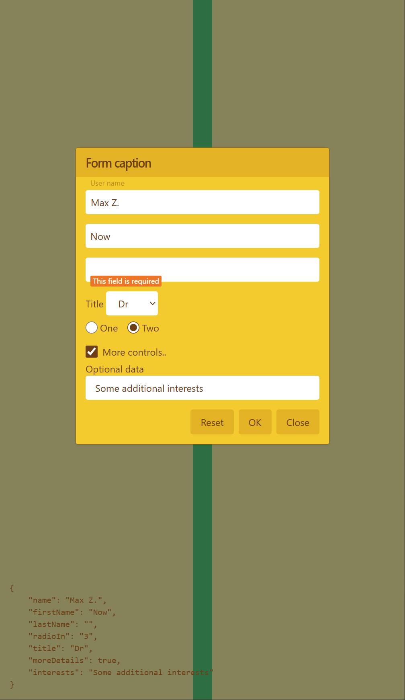

### About

React forms with react-hook-form.

### Links, refs, credits

* [react-hook-form](https://react-hook-form.com)
* Usage examples from the react-hook-form repo (v7):
  * [all examples at codesandbox](https://github.com/react-hook-form/react-hook-form/tree/master/examples)
    * [nested-portal](https://codesandbox.io/s/react-hook-form-nested-portal-bw8m75?file=/src/App.tsx)
  * [reset form](https://github.com/react-hook-form/react-hook-form/blob/master/examples/V7/resetForm.tsx)
  * [conditional fields](https://github.com/react-hook-form/react-hook-form/blob/master/examples/V7/conditionalFields.tsx)
  * [UseFormMethods](https://github.com/react-hook-form/react-hook-form/blob/master/examples/V7/typescript/UseFormMethods.tsx)
  * [V6 - React Hook Form - building dynamic form (Field Array)](https://www.youtube.com/watch?v=LhIvi4XHIco)
* [Work with react-hook-form](https://habr.com/ru/company/timeweb/blog/722108)

